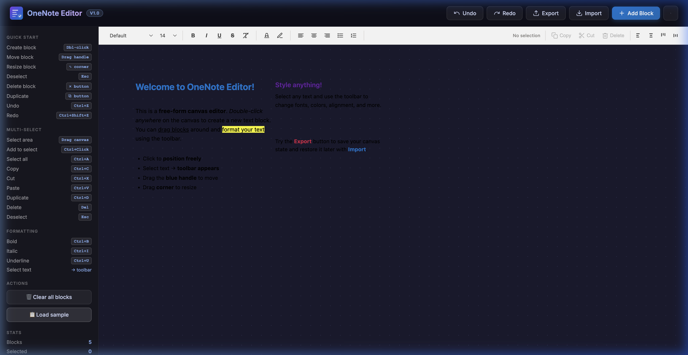

# onenote-style-editor

A zero-dependency JavaScript library implementing a **Microsoft OneNote-style free-form canvas editor**. Users can double-click anywhere to place text blocks, drag them freely, and apply rich text formatting via a unified header toolbar.



## Features

- 🖥️ **Fixed Ribbon Toolbar** — Professional OneNote-style header for all formatting and block actions
- 🖱️ **Click anywhere** — Double-click to create a text block exactly where you want it
- 🖱️ **Multi-select** — Rubber-band selection area or Ctrl/Cmd+Click to group blocks
- ✨ **Bulk Operations** — Align, Copy, Cut, Delete, and Paste multiple blocks at once
- 🔄 **Undo/Redo History** — Robust history stack captures every text edit, style change, and drag
- ✏️ **Rich text formatting** — Bold, italic, underline, strikethrough, alignment, and lists
- 🔤 **Font controls** — family, size, text color, and highlight color
- 🎨 **SVG Icon Library** — Clean,organized toolkit that adapts to light/dark themes
- 🌙 **System Theme Support** — Automatically detects and follows system dark mode preference
- 💾 **State persistence** — Full JSON serialization via `getState()` and `loadState(state)`
- 📦 **Zero Dependencies** — Lightweight, pure vanilla JS (ESM + UMD)

---

## Installation

```bash
npm install onenote-style-editor
```

Or use the UMD bundle directly in a `<script>` tag:

```html
<script src="dist/onenote-editor.umd.js"></script>
```

---

## Quick Start

### ESM (with a bundler)

```js
import { OneNoteEditor } from 'onenote-style-editor';

const editor = new OneNoteEditor('#my-container');
```

### UMD (browser script tag)

```html
<div id="my-editor" style="width:100%;height:100vh;"></div>
<script src="onenote-editor.umd.js"></script>
<script>
  const editor = new OneNoteEditor.OneNoteEditor('#my-editor');
</script>
```

---

## API

### `new OneNoteEditor(target, options?)`

| Parameter | Type | Description |
|-----------|------|-------------|
| `target` | `string \| HTMLElement` | CSS selector or DOM element to mount the editor into |
| `options.dark` | `boolean` | Enable dark mode (default: `false`) |
| `options.showHint` | `boolean` | Show "double-click to type" hint on first load (default: `true`) |

---

### Methods

| Method | Returns | Description |
|--------|---------|-------------|
| `addBlock(options?)` | `TextBlock` | Programmatically add a text block |
| `removeBlock(id)` | `this` | Remove a block by its id |
| `getBlocks()` | `TextBlock[]` | Get all current blocks |
| `getState()` | `object` | Export canvas as a JSON-serializable object |
| `loadState(state)` | `this` | Restore canvas from a previously exported state |
| `setDark(dark)` | `this` | Switch between light / dark mode |
| `destroy()` | `void` | Destroy the editor and clean up all DOM/events |

#### `addBlock(options?)` options

| Option | Type | Default | Description |
|--------|------|---------|-------------|
| `x` | `number` | `100` | Left position in pixels |
| `y` | `number` | `100` | Top position in pixels |
| `content` | `string` | `''` | Initial HTML content |
| `width` | `number` | `240` | Initial width in pixels |
| `id` | `string` | auto | Custom block id |

---

### Events

Use `.on(event, handler)` / `.off(event, handler)` to subscribe:

| Event | Payload | Description |
|-------|---------|-------------|
| `block:created` | `{ id, x, y, width, content }` | A new block was created |
| `block:deleted` | `{ id }` | A block was deleted |
| `block:moved` | `{ id, x, y, width, content }` | A block was dragged to a new position |
| `content:changed` | `{ id, x, y, width, content }` | A block's content changed |

---

## Example — Auto-save to localStorage

```js
const editor = new OneNoteEditor('#editor');

// Restore saved state
const saved = localStorage.getItem('editor-state');
if (saved) editor.loadState(JSON.parse(saved));

// Auto-save on every change
editor
  .on('content:changed', save)
  .on('block:created', save)
  .on('block:deleted', save)
  .on('block:moved', save);

function save() {
  localStorage.setItem('editor-state', JSON.stringify(editor.getState()));
}
```

---

## Development

```bash
# Install dependencies
npm install

# Build ESM + UMD bundles
npm run build

# Watch mode
npm run dev

# Serve the demo
npm run demo
```

---

## User Interactions
### Basic Editing
| Interaction | Effect |
|-------------|--------|
| Double-click on empty canvas | Creates a new text block |
| Click inside a block | Focuses it for typing |
| Drag the top-handle | Moves the block(s) |
| Drag the ⤡ bottom-right corner | Resizes the block |
| `Escape` | Deselects all blocks |
| `Ctrl+Z` / `Ctrl+Y` | Undo / Redo last action |

### Multi-Select & Bulk Actions
| Interaction | Effect |
|-------------|--------|
| Drag on empty canvas | Create rubber-band selection area |
| `Ctrl/Cmd + Click` | Add/Remove block from selection |
| `Ctrl/Cmd + A` | Select all blocks on canvas |
| `Ctrl + C / X / V` | Copy / Cut / Paste selected blocks |
| `Ctrl + D` | Duplicate selection |
| `Delete` / `Backspace` | Delete selected blocks |
| Fixed Toolbar Buttons | Apply style or alignment to all selected blocks |

---

## License

MIT
